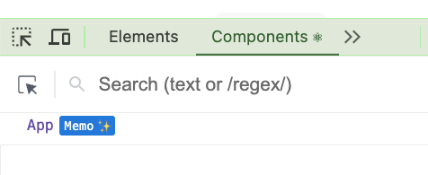

# Creando el proyecto

Cuando trabajas con React y te hace falta meter optimizaciones de renderizado o incluso evitar que en algunos casos se te quede el código pillado, tienes que tirar de hooks como `useMemo` o `useCallback` y esto es un dolor, sobre todo si has tenido opción de probar nuevos frameworks como `Svelte` o `Solid`, ahí te habrás dado cuenta que esos hooks son ñapas manuales, ¿No hay forma mejor de gestionar esto? Pues sí, ... a la vez que React 19, el equipo de React, ha sacado una nueva herramienta que se llama `React Compiler` que se encarga de optimizar el código por ti y poder así olvidarte de esos hooks.

En este serie de ejemplos, vamos a probar varios ejemplos de optimizacíon que usamos en nuestra formaciones y ver que tal se comporta el `React Compiler` con ellos.

Cómo primer ejemplo, creamos un proyecto en blanco y le metemos soporte a React Compiler.

¡ OJO ! Este ejemplos fue creado en febrero de 2025, cuando React Compiler seguía en Beta, así que si estás viendo esto en el futuro, es posible que haya cambios en la forma de instalar el compilador o incluso que ya no sea necesario, puedes mirar está [página oficial de React Compiler](https://react.dev/learn/react-compiler) para ver que tal está la cosa.

Vamos a arrancar el proyecto desde cero, para eso usamos vite:
```bash
npm create vite@latest mi-proyecto --template react-ts
```

Elije React y TypeScript.

Ojo a la fecha que creamos el repo, instalaba todavía la versión 18, vamos a actualizar a la 19.

```bash
npm install react@latest react-dom@latest
```

Y ojo a la fecha que creamos el repo, había que instalar el react compiler, porque estaba en beta, así que vamos a instalarlo.

```bash
npm install --save-dev babel-plugin-react-compiler@beta eslint-plugin-react-compiler@beta
```

```bash
npm install react-compiler-runtime@beta
```

Y configurarlo en en el archivo `vite.config.ts`:

```diff
import { defineConfig } from "vite";
import react from "@vitejs/plugin-react";

// https://vite.dev/config/
export default defineConfig({
  plugins: [
    react(
+    {
+      babel: {
+        plugins: [["babel-plugin-react-compiler", { target: "19" }]],
+      },
+    }
    ),
  ],
});
```

Y ahora arrancamos el proyecto y para ver que esta activo el plugin, si abres las dev tools (pestaña de `Components`), puedes ver que los componentes optimizados tienen unas estrellitas.

```bash
npm run dev
```

Para quitar ruido he borrado imágenes y código que no se usan, y creado un componente `Demo`.



Ya lo tenemos listo así que vamos a empezar a jugar con esto.
